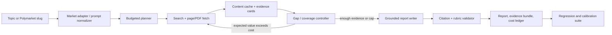

# Standalone, budget-bounded research system — design brief

**Audience:** a cost-conscious builder who wants reproducible, evaluable research reports, initially driven by Polymarket events.

**Date:** 2026-09-06

## Recommendation

Build a small **TypeScript/Node.js library** around a **deterministic research state machine**, not an autonomous open-ended agent. Every run receives an explicit dollar cap and an `as_of` time; it creates a frozen evidence bundle, a cited report, and a machine-readable run ledger. A CLI and a thin local web form are consumers of the library, rather than the place where research logic lives.

The core quality loop is not “did the agent give the eventual winning answer?” It is:

1. Did it identify the resolution rules, important unknowns, and relevant evidence available at the cutoff?
2. Did its citations actually support its factual claims?
3. Did it cover the test's predeclared, weighted atomic facts and decision factors?
4. If it made a forecast, was its stated probability calibrated after resolution?

This separates research quality from luck and prevents outcome leakage.

## Scope and non-goals

The initial product takes either a free-text topic or `--polymarket-slug`, optionally an `--as-of` timestamp and `--budget-usd`, and returns a Markdown/HTML report plus artifacts. It must work with an OpenAI-compatible local Ollama endpoint or OpenRouter. It does not place trades, use private data, or claim that the research is investment advice.

Do not start by building multi-agent delegation, a vector database service, or a general RAG memory. A SQLite database plus per-run files is sufficient and makes experiments portable.

## Architecture



Use a provider interface with only three operations: `complete`, `embed`, and `estimate_cost`. Both OpenRouter and Ollama can implement the same OpenAI-style chat client; add a small OpenRouter adapter for actual billing fields. Ollama's local embedding endpoint accepts one or many inputs, so it is a sensible no-API-cost choice for chunk retrieval ([Ollama embeddings documentation](https://docs.ollama.com/api/embed)).

For OpenRouter, retrieve model metadata and price data at run start from the Models API; its model object contains pricing, and its response `usage` reports native-token counts. Persist both the pricing snapshot and the response usage, rather than hard-coding model prices ([OpenRouter models documentation](https://openrouter.ai/docs/guides/overview/models), [usage accounting](https://openrouter.ai/docs/cookbook/administration/usage-accounting)).

### Suggested TypeScript repository layout

```text
packages/
  research-core/
    src/
      index.ts              # Stable public exports
      providers/{types,ollama,openrouter}.ts
      market/polymarket.ts
      pipeline/{plan,retrieve,extract,evidence,write,validate}.ts
      storage/{sqlite,cache,artifacts}.ts
      eval/{schema,runner,scorers,calibration}.ts
      prompts/*.ts
    test/{fixtures,evergreen,temporal}/
  research-cli/
    src/main.ts             # Thin Commander CLI
  research-local-ui/
    src/server.ts           # Optional local-only UI/API
runs/<run-id>/{input,evidence,report,ledger}.json
```

Use Node 22+ with TypeScript in strict mode, `zod` for runtime validation, native `fetch`/`undici` for HTTP, and `better-sqlite3` (behind a `RunStore` interface) for the initial local store. Export explicit types and a small `ResearchClient` API from `research-core`; do not expose database internals. Build with `tsup` or `unbuild` to publish both ESM and CJS declarations. Use `vitest` for the regression suite. Prefer `Commander` for `research market <slug>` and a one-page Hono/Fastify local server only after the CLI works. SQLite tables: `runs`, `llm_calls`, `searches`, `documents`, `evidence_cards`, `reports`, `eval_cases`, `eval_results`. Cache fetches by canonical URL and content hash; cache model outputs by a hash of model, prompt version, inputs, and decoding settings.

The core package should have an API along these lines:

```ts
const client = createResearchClient({
  provider: { kind: "openrouter", apiKey, model: "…" }, // or { kind: "ollama", baseUrl, model: "…" }
  store: new SqliteRunStore("./research.db"),
  budget: { hardCapUsd: 1 },
});

const run = await client.researchMarket({ slug, asOf: new Date() });
// run.reportMarkdown, run.evidence, run.ledger, run.stopReason
```

Keep the provider boundary provider-neutral: `complete(request)`, `embed(inputs)`, and `estimateCost(request)`. This lets downstream TypeScript projects supply their own provider, search backend, cache, telemetry, or storage adapter without forking the pipeline.

## Polymarket adapter

For a slug, call `GET https://gamma-api.polymarket.com/events?slug=<slug>` and save the raw response verbatim. Events include their markets, so this avoids extra metadata calls; Gamma is unauthenticated for this use ([Polymarket market-data guide](https://github.com/Polymarket/agent-skills/blob/main/market-data.md), [events API reference](https://docs.polymarket.com/api-reference/events/list-events)). Capture at least:

- event/market title, description, slug, start/end/close times, outcomes and prices;
- the resolution source and exact resolution criteria;
- volume, liquidity, market state, IDs, and fetch time;
- `as_of` set to the time fetched unless explicitly supplied.

Turn the metadata into a research brief: “What must be true for each outcome to resolve?”, “what evidence could change the result before the deadline?”, and “what indicators are available now?” The report should display current market price as an **external baseline**, not as evidence for its own conclusion.

For the example `which-company-has-the-best-ai-model-end-of-september-20260717143435868`, the test needs the event's exact definition of “best AI model,” candidate set, eligible releases, benchmark/ranking source, cutoff time, and dispute/resolution policy. Do not infer those from the slug. If the Gamma response is missing or ambiguous, the run should stop with `NEEDS_RESOLUTION_RULES`, not fabricate a forecast.

## A run that cannot overspend

The budget guard lives outside the model prompt and is checked before *every* paid call:

```text
remaining = hard_cap - actual_spend - reserved_max_for_inflight_calls
reserve = model_price_snapshot(max_input_tokens, max_output_tokens, cache_policy)
if reserve > remaining: skip, downgrade, or stop
call model with strict max tokens
reconcile actual spend from provider usage
```

The run has a query/fetch cap too, because search and page-extraction providers can cost money. Every action records expected cost, actual cost (or `null` locally), time, cache-hit status, model, prompt version, and stop reason. An external call gets a short timeout and one bounded retry; duplicate URL/query/model-prompt calls are cache hits, not new work.

Recommended initial policy for a `$1.00` cloud cap (all values configurable):

| Stage | Maximum share | Method |
|---|---:|---|
| Normalize/plan | 10% | one small or local structured call |
| Search/fetch | 25% | 4–8 queries, 10–15 deduplicated pages |
| Triage/extraction | 15% | deterministic extraction + local embeddings; cheap model only for difficult PDFs |
| Gap-fill | 20% | one targeted wave only if required rubric items remain uncovered |
| Write | 20% | one grounded writer pass from evidence cards |
| Validate | 10% | deterministic checks; sampled judge only in evaluation mode |

Do not run an LLM per page or ask it to summarize all retrieved text. Extract normalized text deterministically, rank chunks using BM25 plus local embeddings/MMR, then let the model read the small set of highest-value excerpts. Limit the report writer to evidence-card IDs; citations are rendered mechanically from those IDs. This makes both cost and citation provenance auditable.

Local mode has no provider bill but is still metered: record generated/prompt tokens, elapsed GPU/CPU seconds, model version, and optionally an electricity-rate estimate. Set the same action and context limits so local results remain comparable to cloud runs.

## Evidence controller and report format

An evidence card is a JSON record:

```json
{
  "claim": "Atomic statement, not a paragraph",
  "claim_type": "fact|forecast_factor|counterargument",
  "source_url": "https://...",
  "source_title": "...",
  "published_at": "...",
  "retrieved_at": "...",
  "excerpt": "supporting passage",
  "source_tier": 1,
  "supports": ["criterion-id"],
  "as_of_ok": true
}
```

The controller keeps a weighted coverage matrix of required criteria versus evidence cards. A new search is justified only if it could cover a high-weight missing criterion, resolve a contradiction, or materially improve source quality. Stop when all must-have criteria have support (or an explicit evidence gap), the cap is reached, or the expected marginal gain falls below a configured threshold.

Report sections: resolution rules and cutoff; executive view and probability/range if requested; evidence by driver; counterevidence; what would change the conclusion; source notes; limitations. Every material assertion links to a source. State observed facts, inferences, and unknowns separately.

## Evaluation suite: use your own benchmark as the product's north star

Use an external benchmark for a sanity check, but your market-specific suite must be the release gate. DeepResearch Bench is a useful optional reference: it has 100 expert-designed tasks across 22 fields and evaluates report quality (RACE) separately from factual/citation grounding (FACT) ([benchmark README](https://github.com/Ayanami0730/deep_research_bench), [paper](https://deepresearch-bench.github.io/static/papers/deepresearch-bench.pdf)). It requires a judge and web-scraping setup, so run it only on a small fixed canary set after meaningful changes—not on every commit. Its public pipeline currently documents paid evaluator models and a scraping key, which is a reason to retain a cheaper in-house gate ([setup notes](https://github.com/Ayanami0730/deep_research_bench)).

### Test taxonomy

| Class | Purpose | Refresh and outcome handling |
|---|---|---|
| Evergreen closed-world | Core research competence, e.g. 2016 election/WWII; facts do not change materially | Versioned gold evidence, reviewed annually |
| Temporal live | Ex-ante market research under a cutoff | Freeze inputs/evidence at creation; never let a later outcome alter the factual rubric |
| Resolved temporal | Measure forecast calibration separately | Attach outcome after resolution; retain the original ex-ante report and rubric |
| Adversarial | Ambiguous wording, conflicting sources, unavailable primary source, or prompt injection in a page | Curated and stable |

Each case should be hand-authored as compact, weighted atomic requirements—not a single “golden report.” Have an LLM propose a first rubric from the event description and 3–5 authoritative seed sources, then require human acceptance/editing. This is the right automation boundary: models are good at drafting criteria; they should not silently define their own exam.

```yaml
id: pm-ai-model-sept-2026-v1
kind: temporal_live
prompt: "Research this market; information cutoff is 2026-09-06T12:00:00Z."
input:
  polymarket_slug: which-company-has-the-best-ai-model-end-of-september-20260717143435868
  as_of: 2026-09-06T12:00:00Z
budget_usd: 1.00
must_cover:
  - id: resolution
    weight: 10
    assertion: "States the exact resolution authority, metric, and cutoff."
    evidence_tier_min: 1
  - id: candidates
    weight: 7
    assertion: "Identifies eligible companies/models and exclusions."
  - id: leading_indicators
    weight: 8
    assertion: "Uses dated, relevant indicators with citations."
  - id: countercase
    weight: 6
    assertion: "Names credible outcome-changing counterevidence."
forbidden:
  - "Any source published after as_of unless clearly labelled as inaccessible/non-evidentiary."
scoring:
  coverage_weight: 0.40
  citation_entailment_weight: 0.30
  source_quality_weight: 0.15
  calibration_weight: 0.10
  cost_efficiency_weight: 0.05
resolution:
  expected_after: 2026-10-01T00:00:00Z
  outcome: null
```

### Scoring without creating a costly benchmark treadmill

Make deterministic checks the default: schema validity, all citations resolvable in the frozen bundle, no post-cutoff dates, source-tier counts, budget compliance, action caps, required headings, and explicit coverage links. Then sample only a fixed subset for a stronger judge:

- **Coverage:** weighted fraction of atomic criteria that have a cited, relevant evidence card.
- **Citation entailment:** a cheap local/low-cost judge labels a stratified sample `supported / partial / unsupported`; manually audit a small random sample to track judge drift.
- **Source quality:** weighted primary/official source coverage, with domain-specific tiers.
- **Calibration:** for resolved markets, score the report's extracted probability using Brier score and log loss; aggregate many events, never overinterpret one result.
- **Efficiency:** quality per dollar, p95 cost, number of fetches, and cache-hit rate. Never optimize the primary score with cost alone; impose hard caps first.

Use three evaluation bands:

1. **PR smoke:** 3 evergreen fixtures, local/deterministic checks only—free/near-free.
2. **Nightly or before a release:** 12–20 stratified cases, capped cloud budget, sampled entailment judge.
3. **Milestone:** fixed 30–50-case internal suite plus a small DeepResearch Bench slice. Archive raw outputs and all price/prompt snapshots.

Evaluate a candidate change against the same evidence snapshots and configurations. Run a blinded pairwise comparison of baseline and candidate reports, then promote only if coverage/citation quality improves without breaking cap or calibration. Retire a temporal case from the live queue when it resolves; preserve it in the resolved set.

## Delivery phases

1. **MVP (one to two weeks):** CLI, Gamma adapter, one provider at a time, URL/content cache, bounded retrieve/write pipeline, Markdown report, JSON ledger, and 5 manually curated tests (3 evergreen/2 live).
2. **Evaluation first:** criterion-to-evidence coverage matrix, cutoff validator, test runner, report diff, and budget dashboard. Do this before adding sophisticated agents.
3. **Quality iteration:** hybrid local embeddings/extraction; cloud planner/writer only when allowed; source-tier policy per market category; one gap-fill wave.
4. **Usability:** local Hono/Fastify page with slug input, budget, provider/model, `as_of`, report view, and run comparison. Add scheduled live tests only when you have explicit desired cadence.

## Decision log / material limitations

- Fetching a page today does not prove what it said at a historical cutoff. For temporal cases, preserve the fetched content at run time or use a licensed/archive source; otherwise label historical support as unverified.
- Prediction markets are excellent for later calibration labels but insufficient by themselves for research-quality judging. A sharp report can be wrong; a lucky report can be weak.
- Exact OpenRouter prices and available models change. Query the live models endpoint at the start of each run and enforce a reserve before calling it, rather than relying on this document.
- The Polymarket request should handle absent/changed metadata defensively. The current public docs describe event lookup by slug and event-level market metadata, but the pipeline must log response shapes and fail closed on missing resolution terms.

## Sources consulted

- [Polymarket market data guide](https://github.com/Polymarket/agent-skills/blob/main/market-data.md) — slug lookup, event/market data, read-only APIs.
- [Polymarket Events API reference](https://docs.polymarket.com/api-reference/events/list-events) — event response fields.
- [OpenRouter Models API documentation](https://openrouter.ai/docs/guides/overview/models) and [usage accounting](https://openrouter.ai/docs/cookbook/administration/usage-accounting) — dynamic model pricing and usage accounting.
- [Ollama embedding API](https://docs.ollama.com/api/embed) — local batched embeddings.
- [DeepResearch Bench repository](https://github.com/Ayanami0730/deep_research_bench) and [paper](https://deepresearch-bench.github.io/static/papers/deepresearch-bench.pdf) — benchmark scope and RACE/FACT evaluation design.
